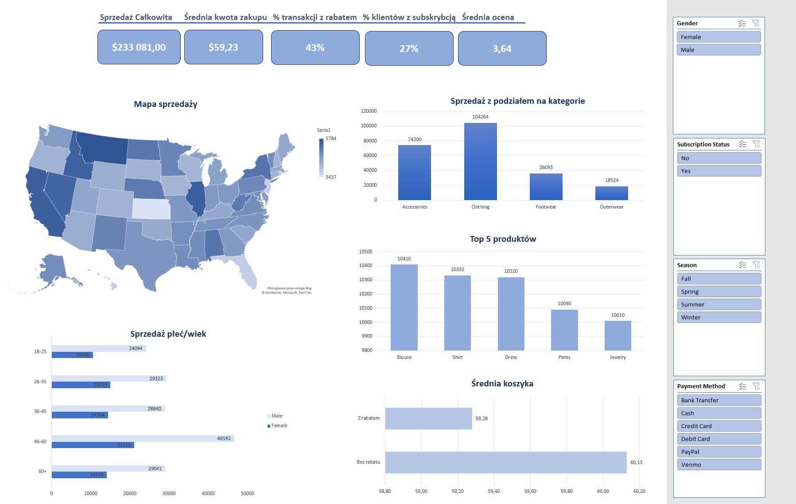

# 📊 Excel Dashboard – Analiza zakupów klientów

Projekt prezentuje moje umiejętności w zakresie **analizy danych w Excelu oraz wizualizacji w dashboardach**.  
Dane pochodzą z przykładowego zbioru dotyczącego zakupów klientów.

---
## 🔎 Zakres analizy
- Sprzedaż całkowita i średnia wartość transakcji
- Struktura sprzedaży wg kategorii produktów i Top 5 produktów
- Sprzedaż wg płci i grup wiekowych
- Analiza sezonowości
- Porównanie koszyka z rabatem i bez rabatu
- Sprzedaż wg metod płatności i lokalizacji

---
## 📊 Podgląd dashboardu

---
## ⚙️ Technologie
- **Excel (Power Query, tabele przestawne, fragmentatory, wykresy)**
- **GitHub** – wersjonowanie i dokumentacja

---
## 📌 Wnioski
- Największa sprzedaż pochodzi z kategorii **Clothing**.  
- Kluczowym segmentem klientów są **mężczyźni w wieku 46-60**.   
- Sprzedaż jest najwyższa w sezonie **Fall i Spring**.
- Najlepiej sprzedającym produktami są **Blouse, Shirt, Dress, Pants, Jewelery**  

---
## 👤 Autor
Ernest K.  
🔗 [LinkedIn](https://www.linkedin.com/in/ernest-k98/)  
📧 e-mail: ernest.krzysik@onet.pl
